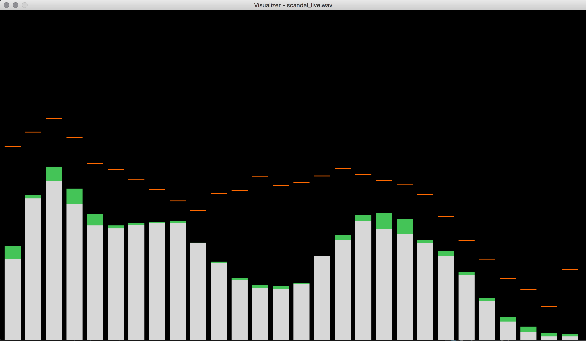

# vis.go

Visualization of music, using `fftw3` and displayed with `glfw/v3.2`

# Building

To build, you must:
* Acquire and install dependencies
* Have a working go environment/compiler
* Clone the project into the right location

## Dependencies

Currently, dependencies are managed manually, because of the difficulty in encapsulating C depends in a Gopkg.toml file

### C dependencies

You must first install these dependencies:
* fftw3
* glfw 3.2
* opengl v2.1 (or higher, I think)

and the headers for those libraries must be available in the include path.

Once you have installed the dependencies on the

### Go dependencies

The dependencies are managed by [dep](https://github.com/golang/dep) which produces `Gopkg.lock` (containing versions of
the dependencies to use). You can get all Go dependencies by running `dep ensure -v`, which will produce a `vendor` folder
allowing you to build the code. You can only perform this if the code is checked out to the right location (`$GOPATH/src/github.com/Twister915/vis.go`)

If you choose to download the dependencies manually, you can use the following list:

You should grab the following go packages:
* `github.com/rs/zerolog`
* `golang.org/x/exp/mmap`
* `github.com/hajimehoshi/oto`
* `github.com/go-gl/gl`
* `github.com/go-gl/glfw`

and the following test dependencies:
* `github.com/onsi/ginkgo`
* `github.com/onsi/gomega`
* `github.com/davecgh/go-spew/spew`

## Compiling

To compile the program, run `make build` or simply `make`

The output should be produced at `./viz` which can be invoked with a single argument (the wav file to visualize)

# Download tool

To download wavfiles from youtube videos, make sure you install both [youtube-dl](https://github.com/rg3/youtube-dl) and [ffmpeg](https://www.ffmpeg.org/), then
simply invoke `./download filename_to_save_as https://www.youtube.com/watch?v=link` to produce `filename_to_save_as.wav` which can be visualized by
running `./viz filename_to_save_as.wav` (so long as you've followed the build steps to produce an executable `./viz` file)